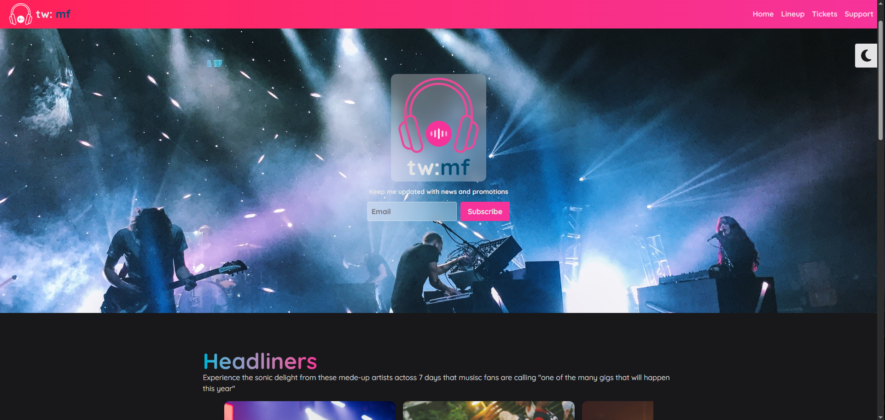

# 🎸 Music Festival Landing Page

A responsive, interactive landing page for a fictional 7-day music festival, built with **HTML**, **Tailwind CSS v4**, and a touch of **vanilla JavaScript**.

## 🚀 Live Preview

https://music-festival-weld.vercel.app/

---

## 📸 Screenshots



---

## 🛠️ Built With

- **HTML5**
- **Tailwind CSS v4** (via CLI)
- **Vanilla JavaScript**
- **Font Awesome Icons**
- Custom utilities, animations & responsive design

---

## 📁 Project Structure

```bash
TAILWIND-COURSE-STARTER/
├── dist/
├── node_modules/
├── src/
│   ├── assets/
│   │   ├── fontawesome/
│   │   └── images/
│   ├── index.html
│   └── input.css
├── .gitignore
├── package-lock.json
├── package.json
└── README.md
```

---

## ✨ Features

- 🌗 **Dark/Light mode** toggle
- 📱 **Responsive design** (mobile-first)
- 🎞️ **Carousel** showcasing headliners
- 📅 Daily **performance lineup**
- 🎟️ Ticket pricing section
- 🧠 Custom Tailwind variants: `group-open`, `peer-open`, `dark`
- 💅 Custom utilities and `@apply` usage for semantic components
- 🌊 Animated “sound wave” visual beneath the brand logo

---

## 📦 Installation & Development

### 1. Clone the repository

```bash
git clone https://github.com/RenjiMW/music-festival.git
cd music-festival
```

2. Install Tailwind CLI dependencies

```bash
npm install
```

3. Run Tailwind in watch mode (development)

```bash
npm run tw:build
```

The site uses Tailwind CLI to compile styles from src/input.css into dist/output.css.

4. Open the page
   Open index.html in your browser (you may need to use a live server if fonts or assets don’t load locally).

## 🧰 Useful Scripts

| Command            | Description                                |
| ------------------ | ------------------------------------------ |
| `npm run tw:build` | Watch and build Tailwind styles to `/dist` |
| `npm run build`    | One-time build to `/src/output.css`        |

## 📚 Credits

This project was created based on the course:

[**Tailwind CSS v4 – Beginner to Pro**](https://www.udemy.com/course/tailwind-css-zero-to-hero/?couponCode=KEEPLEARNING)  
by **Tom Phillips**, available on [Udemy](https://www.udemy.com/).

## 🧠 Lessons Learned

- This project helped develop practical skills in:
- Writing semantic HTML with accessibility in mind
- Building responsive UIs using Tailwind CSS utility-first workflow
- Creating custom animations and variants in Tailwind v4
- Using peer, group, and dark mode features
- Structuring and documenting frontend projects professionally

## 🏁 TODO (Suggestions for Future Work)

- Add a working subscription form (with backend or 3rd-party service)
- Make carousel swipeable on mobile
- Extract data (e.g., lineup) into JSON and render dynamically with JS
- Add page transitions and interactive ticket purchase flow

📃 License
This project is licensed under the ISC License.
